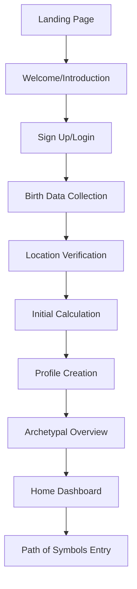

# MyDivinations Web User Onboarding Flow

This document outlines the user onboarding experience for the MyDivinations web application, detailing the flow, design considerations, and implementation requirements.

## Onboarding Goals

The onboarding process aims to:

1. Introduce users to the MyDivinations concept and value proposition
2. Collect essential birth data for astrological calculations
3. Create a personalized user profile with archetypal insights
4. Provide an intuitive entry point to the Path of Symbols journey
5. Set appropriate expectations for the experience

## User Flow Overview

## Detailed Screen Specifications

### 1. Landing Page

**Purpose:** Attract users and communicate the value proposition

**Key Elements:**
- Hero section with fractal visualization background
- Clear, concise headline about consciousness exploration
- Brief value proposition statement
- Call-to-action button: "Begin Your Journey"
- Subtle animation indicating depth and movement

**User Actions:**
- Click "Begin Your Journey" to start onboarding
- Optional: Scroll to learn more about MyDivinations

**Technical Requirements:**
- Optimized hero image/animation for fast loading
- Responsive design for all device sizes
- Performance focus for first meaningful paint

### 2. Welcome/Introduction

**Purpose:** Introduce the concept of Fractal Resonance Cognition and archetypal patterns

**Key Elements:**
- Brief introduction to MyDivinations (2-3 sentences)
- Explanation of how the journey works (3-4 bullet points)
- Visual representation of archetypal patterns
- Progress indicator (1 of 7)
- Continue button

**User Actions:**
- Read introduction
- Click "Continue" to proceed

**Technical Requirements:**
- Progressive disclosure of information
- Smooth transitions between screens
- Option to skip introduction for returning users

### 3. Sign Up/Login

**Purpose:** Create account or authenticate returning users

**Key Elements:**
- Email input field
- Password input field
- Social login options (Google, Apple)
- Magic link option (passwordless login)
- Toggle between sign up and login
- Progress indicator (2 of 7)

**User Actions:**
- Enter email/password or choose social login
- Click "Continue" to proceed

**Technical Requirements:**
- Integration with Auth.js
- Form validation and error handling
- Secure password requirements
- Remember login state

### 4. Birth Data Collection

**Purpose:** Gather accurate birth information for astrological calculations

**Key Elements:**
- Date picker for birth date
- Time picker for birth time
- "Time unknown" option with explanation of impact
- Brief explanation of why this data matters
- Progress indicator (3 of 7)

**User Actions:**
- Enter birth date
- Enter birth time (or select "time unknown")
- Click "Continue" to proceed

**Technical Requirements:**
- Intuitive date/time selection for mobile
- Validation of realistic dates/times
- Clear error messages for invalid inputs
- Data saving during the process

### 5. Location Verification

**Purpose:** Confirm accurate birth location for astrological calculations

**Key Elements:**
- Search input for birth location
- Map visualization with pin
- Confirmation of coordinates
- Option to adjust location manually
- Progress indicator (4 of 7)

**User Actions:**
- Enter and select birth location
- Verify on map
- Adjust if needed
- Click "Continue" to proceed

**Technical Requirements:**
- Geocoding integration
- Map visualization component
- Location search autocomplete
- Coordinate validation

### 6. Initial Calculation

**Purpose:** Process astrological data and generate initial profile

**Key Elements:**
- Loading animation with fractal elements
- Progress visualization
- Brief educational content about calculations
- Progress indicator (5 of 7)

**User Actions:**
- Wait for calculations to complete (passive)

**Technical Requirements:**
- Backend API integration with Astrology Engine
- Graceful handling of calculation errors
- Fallback for offline scenarios
- Timeout handling for slow connections

### 7. Profile Creation

**Purpose:** Personalize the user's experience

**Key Elements:**
- Username/display name input
- Profile picture upload (optional)
- Preference selection for guidance depth
- Communication preferences
- Progress indicator (6 of 7)

**User Actions:**
- Enter display name
- Optionally upload profile picture
- Select experience preferences
- Click "Continue" to proceed

**Technical Requirements:**
- Image upload and processing
- Form validation
- Preference storage in user profile
- Synchronization with backend

### 8. Archetypal Overview

**Purpose:** Introduce the user's personal archetypal profile

**Key Elements:**
- Visual representation of primary archetypes
- Brief explanation of the user's archetypal pattern
- Indication of current cosmic influences
- Option to explore more or continue
- Progress indicator (7 of 7)

**User Actions:**
- Review archetypal profile
- Click "Explore More" or "Continue to Dashboard"

**Technical Requirements:**
- Dynamic content based on astrological calculation
- Visual representation of archetypal patterns
- Responsive design for profile visualization

### 9. Home Dashboard

**Purpose:** Provide central navigation hub and daily insights

**Key Elements:**
- Welcome message with user's name
- Current archetypal overview summary
- "Begin Journey" call-to-action button
- Daily insight or reflection
- Navigation to profile, settings, past journeys

**User Actions:**
- Click "Begin Journey" to start Path of Symbols
- Explore dashboard elements
- Navigate to other sections

**Technical Requirements:**
- Dynamic content based on user profile
- Real-time astrological updates
- State management for user preferences
- Caching for offline access

## Visual Design Considerations

### Color Transitions
- Gradual color transitions through the onboarding flow, from cosmic blues to transformation teal
- Color intensity increases as user progresses deeper into the journey
- Personalized color elements based on user's archetypal profile

### Motion Design
- Subtle fractal animations that respond to user progress
- Smooth transitions between screens (slide transitions)
- Particle effects for calculation visualization
- Pulsing elements to indicate interactivity

### Typography Usage
- Larger, more expressive headlines for emotional impact
- Clean, highly readable body text for instructions
- Gradual introduction of archetypal symbolism in typography

## Responsive Considerations

### Mobile (0-639px)
- Single column layout
- Larger input elements for touch
- Simplified visualizations
- Bottom sheet modals instead of side drawers
- Virtual keyboard considerations for form inputs

### Tablet (640px-1023px)
- Two-column layout for some screens
- Side-by-side forms and explanations
- Enhanced visualizations
- Split-screen options for certain steps

### Desktop (1024px+)
- Multi-column immersive layouts
- Richer fractal visualizations
- Hover state interactions
- Sidebar navigation options
- More detailed archetypal displays

## Onboarding Variants

### Quick Onboarding
- For users who want to explore quickly
- Essential information only (birth date, location)
- Simplified profile creation
- Option to enhance profile later

### Deep Onboarding
- For users seeking comprehensive experience
- Additional questions about personal resonance
- More detailed archetypal explanation
- Guided tour of features

### Returning User Flow
- Simplified welcome back message
- Profile verification
- Recent cosmic changes highlight
- Continuation of previous journey if applicable

## Implementation Phases

### Phase 1 (MVP)
- Basic onboarding flow with essential data collection
- Email/password authentication
- Simplified archetypal overview
- Basic home dashboard

### Phase 2 (Enhancement)
- Social login options
- Magic link authentication
- Enhanced visual effects and animations
- Expanded archetypal profile visualization

### Phase 3 (Advanced Features)
- Personalized onboarding paths based on user interests
- Integration with synchronization features
- Advanced birth time rectification
- Connected experience with mobile app

## Accessibility Considerations

- High contrast mode for all screens
- Screen reader compatible flows
- Keyboard navigation support
- Alternative text for all visualizations
- Reduced motion option
- Font size adjustment capability

## Error Handling

### Common Error Scenarios
- Invalid birth data entry
- Location not found
- Calculation failures
- Network connectivity issues
- Authentication failures

### Error Recovery Approaches
- Clear error messages with recovery instructions
- Option to skip problematic steps when possible
- Automatic retry mechanisms
- Offline data storage and synchronization
- Support contact option

## Success Metrics

- Completion rate of onboarding flow
- Time to complete onboarding
- Accuracy of birth data provided
- Engagement with archetypal profile
- Progression to Path of Symbols
- Return rate after initial experience

## Technical Implementation Notes

- Progressive form data saving throughout the flow
- Restore session capability for interrupted onboarding
- API caching for faster calculations
- Prefetching next screen data
- Skeleton loading states for all screens

---

*Last Updated: March 16, 2025 | 21:30 PST*  
*MyDiv FD*